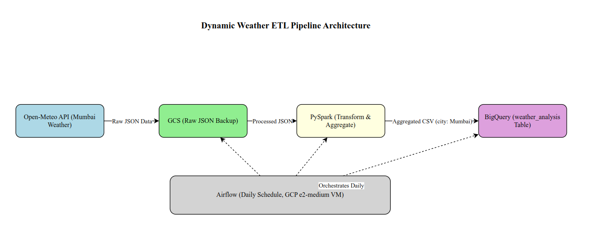

# Dynamic Weather ETL Pipeline

This project is a fully automated ETL (Extract, Transform, Load) pipeline that fetches daily weather data for Mumbai, processes it using PySpark, and stores the results in Google BigQuery. It is orchestrated by Apache Airflow on a GCP virtual machine.

## Project Overview
- **Extract**: Fetches hourly weather data for the previous day from the Open-Meteo API and saves it to Google Cloud Storage (GCS).
- **Transform**: Uses PySpark to compute average temperature, minimum temperature, and total precipitation for the day.
- **Load**: Appends the transformed data to a BigQuery table for historical tracking.
- **Automation**: Scheduled daily with Airflow.

## Files
- `weather_etl_pipeline.ipynb`: Colab notebook with the ETL code for testing.
- `weather_etl_dag.py`: Airflow DAG for scheduling the pipeline.
- `sample_results.csv`: Sample output from the BigQuery table.
- `architecture.png`: Diagram of the pipeline architecture.

## Architecture

## Setup
- Deploy on a GCP VM with Airflow, PySpark, and Google Cloud SDK installed.
- Replace placeholder paths (e.g., `your-key.json`, `your-bucket`) with actual values.
- Schedule the DAG with `schedule_interval='@daily'`.

## Results
The pipeline successfully processes yesterday's weather data (e.g., 2025-09-26) and appends it to BigQuery.

## GitHub Repository
[https://github.com/your-username/weather-etl-pipeline](https://github.com/your-username/weather-etl-pipeline)# Mumbai-weather-etl
A daily ETL pipeline for Mumbai weather data using PySpark, Airflow, and GCP
