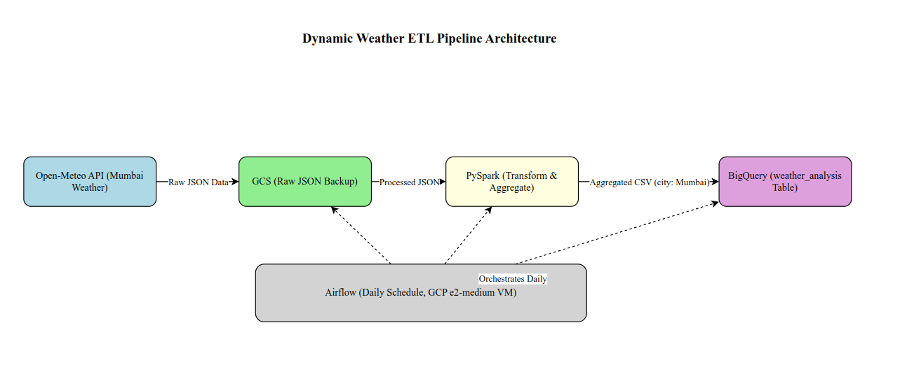

# Project Documentation: Dynamic Weather ETL Pipeline (v2.0)

## Project Overview
This project implements a production-ready ETL pipeline for processing **hourly** weather data for Mumbai, India, using the Open-Meteo API, PySpark, Apache Airflow, Google Cloud Storage (GCS), and Google BigQuery. The pipeline extracts the previous day's hourly data, transforms it into key aggregated metrics (minimum, maximum, and average temperatures; total and average precipitation), backs up raw data to GCS, and appends the results to a BigQuery table. It runs daily as a scheduled batch process on a GCP VM, orchestrated via a custom Dockerized Airflow setup.

This version evolves from v1.0: switched from 3-day daily summaries to targeted hourly fetches for precise averages, added average precipitation metrics, enabled GCS raw backups, and introduced full Docker orchestration for reliability.

---

## Technical Details

### Tools and Technologies
- **Open-Meteo API**: Source for hourly weather data (temperature_2m, precipitation).
- **PySpark**: For loading JSON, filtering to previous day, and computing aggregations.
- **Apache Airflow**: Orchestrates the workflow (extract → transform → load) with daily DAG scheduling, via custom Docker image.
- **GCS**: Backs up raw API JSON extracts.
- **Google BigQuery**: Appends daily aggregated row to a dataset table.

### Data Flow
1. **Extract**: Call Open-Meteo API for previous day's hourly data (Mumbai lat/long: 19.0760, 72.8777); save JSON to local path and upload to GCS.  
2. **Transform**: Parse JSON in PySpark; filter timestamps; aggregate (min_temp, max_temp, avg_temp from temperature_2m; total_precip as sum, avg_precip as mean from precipitation).  
3. **Load**: Write aggregated CSV to BigQuery with `WRITE_APPEND` for historical accumulation.

#### Example Aggregated Output (BigQuery row)

| Date       | City   | Max Temperature | Min Temperature | Avg Temperature | Total Precipitation | Avg Precipitation |
|-------------|--------|-----------------|-----------------|-----------------|---------------------|-------------------|
| 30-10-2025  | Mumbai | 29.0°C          | 27.0°C          | 27.77°C         | 10.2mm              | 0.43mm            |
| 29-10-2025  | Mumbai | 30.1°C          | 27.8°C          | 28.63°C         | 5.8mm               | 0.24mm            |

---

## Setup and Deployment
1. **Environment Setup** (GCP VM, e.g., e2-medium Ubuntu 20.04):
   - Install Docker: `sudo apt-get update && sudo apt-get install docker.io -y`.
   - Enable/start Docker: `sudo systemctl start docker && sudo systemctl enable docker`.
   - Install Java for Spark: `sudo apt-get install openjdk-11-jdk -y`; export `JAVA_HOME=/usr/lib/jvm/java-11-openjdk-amd64`.
   - Install Google Cloud SDK: `curl https://sdk.cloud.google.com | bash`; run `gcloud init`.
2. **Configuration**:
   - Add GCP service account JSON to local `config/` (gitignored).
   - Set env vars (see [ENVIRONMENT.md](ENVIRONMENT.md) for details/examples):
     - `GCP_KEY_PATH`: Container path to JSON (e.g., `/opt/airflow/config/key.json`).
     - `GCP_BUCKET_NAME`: GCS bucket (e.g., `raw_weather_data_backup`).
     - `GCP_PROJECT_ID`: Project ID (e.g., `subtle-seer-472708-q3`).
     - `DATA_PATH`: Script I/O path (default: `/opt/airflow/scripts`).
   - In `dags/weather_etl_dag.py`, update BigQuery table ref (e.g., `project.dataset.weather_metrics`).
3. **Build and Run**:
   - Build image: `sudo docker build -t weather-etl-airflow .`.
   - Run (replace placeholders; full example in ENVIRONMENT.md):

sudo docker run -d --name weather_airflow -p 8080:8080 \
  -e GCP_KEY_PATH=/opt/airflow/config/<KEY>.json \
  -e GCP_BUCKET_NAME=<BUCKET> \
  -e GCP_PROJECT_ID=<PROJECT> \
  -e DATA_PATH=/opt/airflow/scripts \
  -v $(pwd):/opt/airflow:rw \
  -v $(pwd)/config/<KEY>.json:/opt/airflow/config/<KEY>.json:ro \
  weather-etl-airflow

- UI: `http://<VM_IP>:8080` (admin/admin). Enable/trigger `weather_data_mumbai` DAG (daily @ midnight UTC).

## Challenges and Resolutions
- **Spark/Java Setup**: PySpark failed without Java; resolved via OpenJDK 11 install and `JAVA_HOME` in Dockerfile.
- **Docker Mounting/Ports**: Volume errors and port 8080 conflicts; fixed with `-rw` volumes and explicit `-p 8080:8080`.
- **API Relevance**: Fetches included extraneous dates; added dynamic "yesterday" filter in `extract_api_data.py`.
- **Metric Precision**: v1.0's daily API lacked true avgs; upgraded to hourly params for accurate min/max/mean calcs in `pyspark_data_clean.py`.

## Future Improvements
- Eliminate local file saves by uploading raw JSON directly to GCS in extract step, and update PySpark to read directly from GCS.
- Add Airflow alerting (e.g., email/Slack on task failures).
- Parameterize for multi-city (e.g., via DAG vars).
- Unit tests for transforms (PyTest on sample JSON).
- [From v1.0, implemented]: Hourly granularity and `WRITE_APPEND` loading.

## Contributors
- Nithesh Kumar [https://github.com/Nithesh011]
